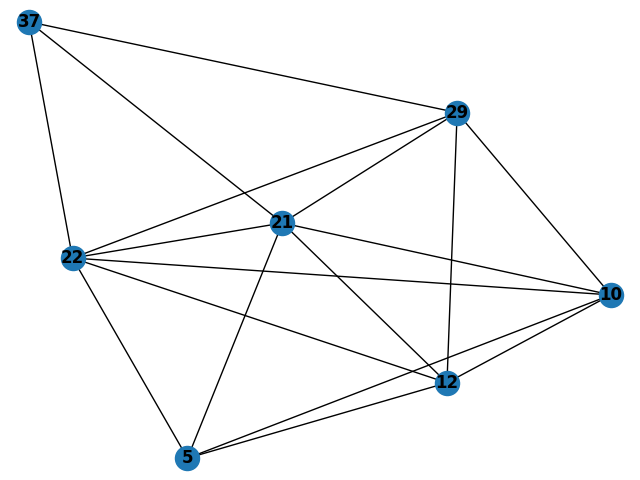

# Represent Traffic As Graph
To learn the relation between vehicles in traffic, connection between vehicles is captured on a graph network. 
Connections are made based on the distance between one another.    
This is created using the NGSIM i-80 dataset.  

The image below shows an example of a graph involving 7 vehicles in the scene.

  

